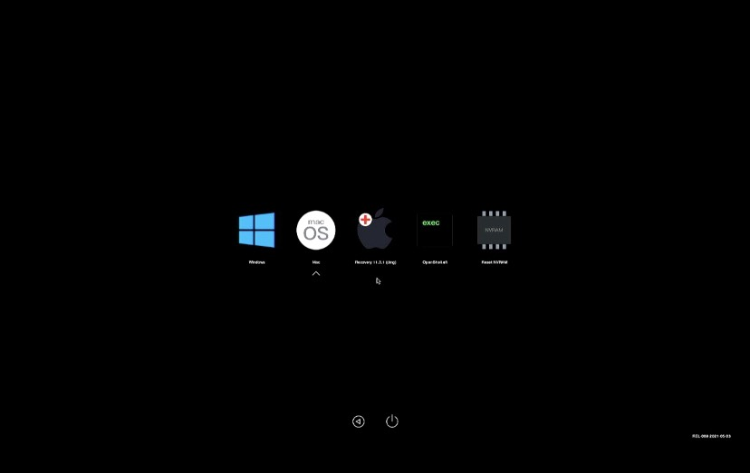

# Hackintosh-OpenCore-Ryzen
## Preview

## System Specs

* **Motherboard:** ASUS ROG STRIX B450-I GAMING
* **Processor:** AMD Ryzen 5 3600
* **Graphics:** Sapphire PLUSE Radeon RX 580 8GB
* **RAM:** G.Skill F4-3200C16D-32GTZRX
* **SSD:** WD Blue 3D NAND SATA SSD 500GB

## Links
* **OpenCore**
* https://dortania.github.io/OpenCore-Install-Guide/
* https://dortania.github.io/OpenCore-Install-Guide/AMD/zen.html
* https://dortania.github.io/OpenCore-Post-Install/universal/memory.html#mapping-our-memory
* https://github.com/acidanthera/OpenCorePkg/releases/

* **Kexts**
* https://github.com/acidanthera/VirtualSMC/releases
* https://github.com/acidanthera/Lilu/releases
* https://github.com/acidanthera/WhateverGreen/releases
* https://github.com/acidanthera/AppleALC/releases
* https://github.com/khronokernel/SmallTree-I211-AT-patch/releases
* https://github.com/trulyspinach/SMCAMDProcessor/releases/
* https://github.com/acidanthera/RestrictEvents/releases

* **SSDTs**
* https://github.com/dortania/Getting-Started-With-ACPI/blob/master/extra-files/compiled/SSDT-CPUR.aml
* https://github.com/dortania/Getting-Started-With-ACPI/blob/master/extra-files/compiled/SSDT-EC-USBX-DESKTOP.aml

* **Firmware Drivers*
* https://github.com/acidanthera/OcBinaryData/blob/master/Drivers/HfsPlus.efi

* **Application*
* https://github.com/corpnewt/ProperTree
* https://github.com/corpnewt/GenSMBIOS
* https://github.com/acidanthera/dmidecode/releases

* **Opencanopy*
* https://github.com/lichongjia/OpenCanopy-Icons/releases/

* **Pathches*
* https://github.com/AMD-OSX/AMD_Vanilla/tree/opencore/17h_19h
* https://github.com/dortania/OpenCore-Post-Install/blob/master/extra-files/CustomMemory.plist.zip

